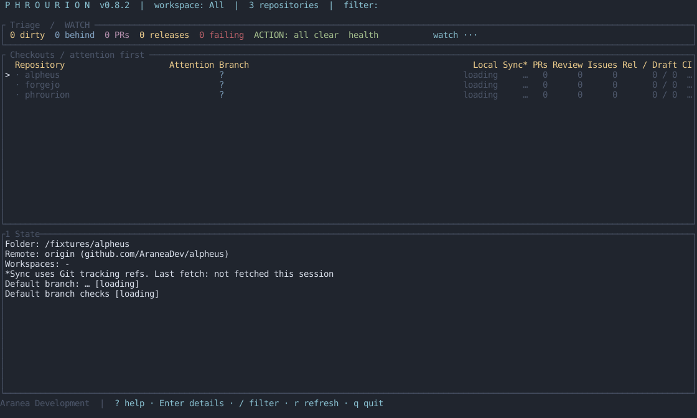
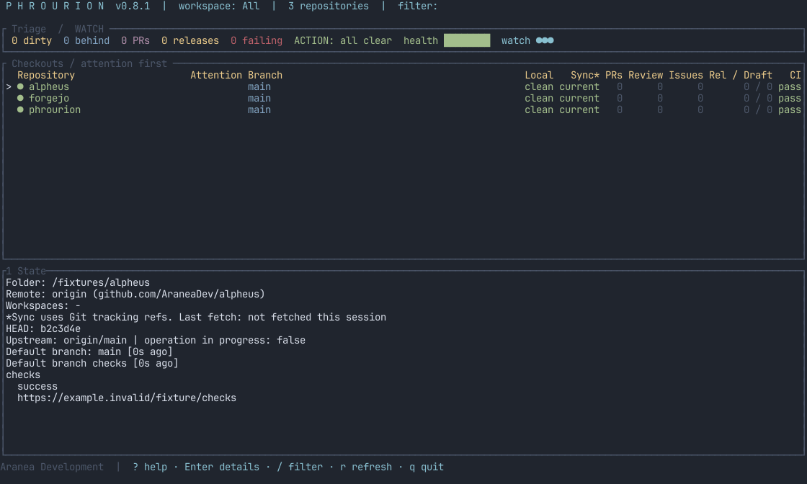

<div align="center">

# Phrourion

**A small watch post for your repositories.**
**The state of every checkout, before it becomes a surprise.**

[](https://github.com/AraneaDev/phrourion/releases)
[](https://github.com/AraneaDev/phrourion/actions/workflows/ci.yml)
[](tests/)
[](./LICENSE)
[](https://github.com/AraneaDev/phrourion)
[](https://github.com/AraneaDev/phrourion/commits/main)
[](https://www.conventionalcommits.org/)
[](#status)



<sub>Generated by <code>scripts/screenshot.sh</code> from deterministic fixture states. Set <code>PHROURION_SCREENSHOT_LIVE=1</code> for a live local-state capture.</sub>

</div>

---

> **Phrourion** (φρουριον) means watch post or small garrison. It is the place
> that keeps the road in sight. This tool keeps local repositories, their remote
> branches, and the work waiting around them in sight too.

**TL;DR:** Phrourion is a terminal dashboard for local repository state, remote
branches, pull requests, checks, and releases. It reads local Git directly and
uses provider adapters for remote data. GitHub works through either a personal
access token or the authenticated `gh` CLI; Forgejo, GitLab, and Bitbucket use
the same account setup. A user-level registry lets you add checkouts without
writing configuration into them.

It is for the moment before you start work and the moment before you commit.
One screen shows whether a checkout is clean, whether its branch is behind, what
is open upstream, and whether a release is waiting for attention.

## Status

> **Status:** pre-release. GitHub, Forgejo, GitLab, and Bitbucket Cloud monitoring
> and the safe fast-forward pull path are ready. Phrourion requires Rust 1.85 or newer.
> Provider authentication works through the CLI, the TUI Accounts modal, an OS
> keyring, or environment variables. See [provider authentication](docs/providers.md).

## What it shows

For every registered repository, Phrourion reports:

- **local state**, including the current branch, clean or dirty working tree,
  staged changes, untracked files, conflicts, and Git operations in progress
- **remote state**, including the default branch, branch position, and provider
  reachability
- **open work**, including pull requests, open issues, and release proposals
  detected from explicit branch, label, and title evidence
- **pending releases**, separating proposed, draft, and published release data
- **checks**, including the configured workflow runs and their current result

Unknown, unavailable, and unsupported data stay distinct from a real zero. A
failed remote query never turns into an empty list, and cached data remains
visible with its stale state while a refresh is retried.

## How it works

Local observations use Git commands in the registered checkout. Remote
observations use a provider adapter with a neutral result model, so the TUI does
not need to know whether data came from GitHub, GitLab, Bitbucket, or Forgejo.
GitHub uses a direct API token when one is configured and otherwise falls back
to `gh api`. All adapters validate provider responses before using them.

The registry lives outside the repositories at
`$XDG_CONFIG_HOME/phrourion/repos.toml`, or the platform configuration directory
when XDG is not available. It stores paths and remote identities, not tokens.

## Actions

The dashboard orders repositories by attention needed: conflicts, diverged
branches, and failed CI first; unpushed commits, incoming updates, and pending
release proposals or drafts next; ordinary uncommitted changes just above quiet
checkouts. Repositories within each group sort alphabetically. The Attention
column shows the highest-priority reason, and selection stays on the same
repository when refreshes change the order. Stale or unavailable observations
do not count as confirmed attention signals; their existing status indicators
remain visible. Compact terminals show repository, attention, and sync columns.
When a repository newly enters conflict, failed-CI, diverged, or pending-release
state while `phro` is running, it raises a desktop notification (`notify-send`
on Linux, `osascript` on macOS) once for that transition, not on every refresh.

The dashboard is read-only until you choose an action. It can refresh local and
remote state, open a repository in the browser, add or remove a checkout, pull
the selected repository after confirmation, and check out a pull request's
branch by number. Press `t` on a selected repository to open a new terminal in
that checkout's folder. Phrourion prefers `$TERMINAL`, then detects `foot`,
`kitty`, `alacritty`, `wezterm`, or `gnome-terminal`.

A pull is allowed only when the checkout is still the registered one, the branch
is attached and unchanged, the working tree is clean, the upstream is configured,
and the update is fast-forward only. A PR checkout is allowed only when the
working tree is clean and no local branch already has the target name; it fetches
GitHub's `refs/pull/<number>/head` and creates a new local branch (`pr/<number>`)
from it. Phrourion never stashes changes, resets, rebases, or resolves conflicts.

The footer keeps the startup guidance compact: `? help · Enter details · /
filter · r refresh · q quit`. Press `?` or `F1` for the complete, contextual
keyboard reference; `F1` also opens it from input and confirmation prompts.
Closing help returns to the interrupted prompt.

### Keyboard reference

The help modal is the source of truth and adapts to the current context. These
are the dashboard’s main shortcuts:

| Context | Keys | Action |
| --- | --- | --- |
| Navigation | `j` / `k`, Up / Down | Select a repository |
| Details | `h` / `l`, Left / Right | Previous / next detail tab |
| Details | `Tab` / `Shift-Tab`, `1`–`6` | Change detail tab |
| Details | PageUp / PageDown, `Esc` | Scroll or reset details |
| Repository | `a`, `d`, `c`, `p` | Add, remove, check out a PR, or pull |
| Repository | `r` / `R` | Refresh selected / all repositories |
| Repository | `o`, `t`, `/` | Open remote, open terminal, or filter |
| Accounts | `s` | Open provider account setup |
| Workspaces | `w`, `n`, `m` / `u` | Select, create, add, or remove membership |
| Prompts | `y` / Enter, `n` / Esc | Confirm or cancel |
| Help | `?` / `F1` | Open the full keyboard reference |
| Help | `j` / `k`, PageUp / PageDown | Scroll the help modal |
| Help | `Esc`, `?`, `F1`, `q` | Close the help modal |
| Any screen | Ctrl-C | Emergency quit |

The shortcuts shown in the modal are contextual: actions that are unavailable
without a selected repository or while another action is running are marked as
unavailable rather than silently doing nothing.

<p align="center">
  
</p>

Use `j`/`k` or Up/Down to select repositories. Press `w` to open the workspace
picker; `All` is always the first option. When adding a checkout from a named
workspace, it is automatically added to that workspace. In the add prompt,
press Tab to complete directory paths relative to the directory where Phrourion
was started. In details, `h`/`l` and
Left/Right move to the previous or next tab, as do Shift-Tab/Tab. Confirmation
prompts accept `y` or Enter and cancel with `n` or Escape.

Named workspaces group repositories without moving or duplicating checkout
registrations. A repository can belong to multiple workspaces, and `All` is
always available:

```bash
phro workspace create AraneaDev
phro workspace add AraneaDev phrourion alpheus
phro workspace list
phro workspace repos AraneaDev
phro workspace remove AraneaDev alpheus
phro workspace delete AraneaDev
phro status --workspace AraneaDev
phro open-terminal phrourion
```

`phro list` includes workspace memberships. Workspace changes are stored in the
user registry alongside repository entries; deleting a workspace never deletes
a checkout.

## Install

Install globally for your user with a current stable Rust toolchain:

```bash
cargo install --git https://github.com/AraneaDev/phrourion --locked --bin phro --bin phrourion
```

This installs both commands in Cargo's bin directory, usually
`~/.cargo/bin`. Add that directory to your shell's `PATH` if needed, then run
`phro` from any folder. No administrator access is required.

From a local checkout, install the current source with:

```bash
cargo install --path . --locked --bin phro --bin phrourion --force
```

Run the same command again to update an existing installation.

The simplest interactive setup is the Accounts modal: start `phro`, press `s`,
enter the provider, host, and token, then press Enter. Tokens are masked and
stored in the operating system keyring; they are not written to `repos.toml`.
The same operation is available non-interactively:

```bash
printf '%s\n' "$TOKEN" | phro auth set --provider github --host github.com --token-stdin
phro auth list
phro auth test --host github.com --provider github
```

For headless environments, set an environment variable instead. Environment
credentials override keyring credentials and are never saved by Phrourion. The
full provider matrix, token scopes, self-hosted examples, and troubleshooting
are in [docs/providers.md](docs/providers.md).

## Use

Discover Git repositories below the current directory and add them to the
registry:

```bash
phro discover . --add
```

Start the dashboard:

```bash
phro
```

`phro` is the short command name. The full `phrourion` binary is installed too.
Both support `add`, `remove`, `list`, and `status`. Run `phro --help` for all
options.

## Development

```bash
cargo fmt -- --check
cargo clippy --all-targets --all-features -- -D warnings
cargo test
```

Install the repository hooks once so the dashboard screenshot stays current and
commit messages are checked for Conventional Commits:

```bash
git config core.hooksPath .githooks
```

See [the design notes](docs/design.md) for the architecture, safety model, and
provider boundary, and [the roadmap](docs/roadmap.md) for what's planned next.

## License

MIT.

---

Built by [Tim Schipper](https://tim-schipper.nl/en) and released as open source under
[Aranea Development](https://aranea-development.nl).
