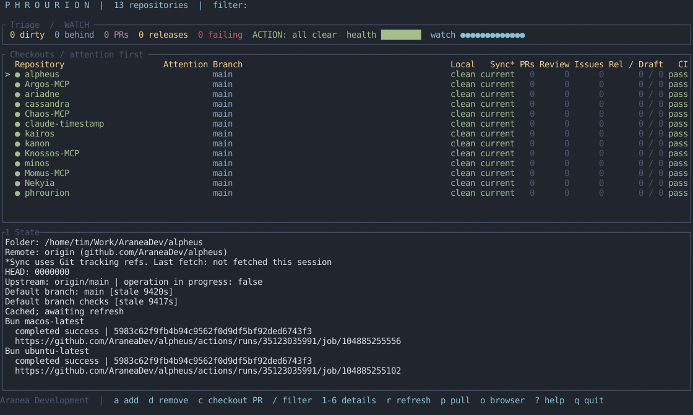

<div align="center">

# Phrourion

**A small watch post for your repositories.**
**The state of every checkout, before it becomes a surprise.**

[](https://github.com/AraneaDev/phrourion/releases)
[](https://github.com/AraneaDev/phrourion/actions/workflows/ci.yml)
[](tests/)
[](./LICENSE)
[](https://github.com/AraneaDev/phrourion)
[](https://github.com/AraneaDev/phrourion/commits/main)
[](https://www.conventionalcommits.org/)
[](#status)



<sub>Generated by <code>scripts/screenshot.sh</code> from the registered checkout names. Set <code>PHROURION_SCREENSHOT_LIVE=1</code> for a live local-state capture.</sub>

</div>

---

> **Phrourion** (φρουριον) means watch post or small garrison. It is the place
> that keeps the road in sight. This tool keeps local repositories, their remote
> branches, and the work waiting around them in sight too.

**TL;DR:** Phrourion is a terminal dashboard for local repository state, remote
branches, pull requests, checks, and releases. It reads local Git directly and
uses provider adapters for remote data, starting with GitHub through the
authenticated `gh` CLI. A user-level registry lets you add checkouts without
writing configuration into them.

It is for the moment before you start work and the moment before you commit.
One screen shows whether a checkout is clean, whether its branch is behind, what
is open upstream, and whether a release is waiting for attention.

## Status

> **Status:** pre-release. GitHub and Forgejo monitoring and the safe fast-forward
> pull path are ready. GitLab and Bitbucket adapters are planned behind the same
> provider boundary. Phrourion requires Rust 1.85 or newer; GitHub monitoring
> requires an authenticated [GitHub CLI](https://cli.github.com/), and Forgejo
> monitoring requires a personal access token in a `PHROURION_TOKEN_<HOST>`
> environment variable (optional for public repositories).

## What it shows

For every registered repository, Phrourion reports:

- **local state**, including the current branch, clean or dirty working tree,
  staged changes, untracked files, conflicts, and Git operations in progress
- **remote state**, including the default branch, branch position, and provider
  reachability
- **open work**, including pull requests, open issues, and release proposals
  detected from explicit branch, label, and title evidence
- **pending releases**, separating proposed, draft, and published release data
- **checks**, including the configured workflow runs and their current result

Unknown, unavailable, and unsupported data stay distinct from a real zero. A
failed remote query never turns into an empty list, and cached data remains
visible with its stale state while a refresh is retried.

## How it works

Local observations use Git commands in the registered checkout. Remote
observations use a provider adapter with a neutral result model, so the TUI does
not need to know whether data came from GitHub, GitLab, Bitbucket, or Forgejo.
The GitHub adapter calls `gh api` and validates paginated responses before using
them.

The registry lives outside the repositories at
`$XDG_CONFIG_HOME/phrourion/repos.toml`, or the platform configuration directory
when XDG is not available. It stores paths and remote identities, not tokens.

## Actions

The dashboard orders repositories by attention needed: conflicts, diverged
branches, and failed CI first; unpushed commits, incoming updates, and pending
release proposals or drafts next; ordinary uncommitted changes just above quiet
checkouts. Repositories within each group sort alphabetically. The Attention
column shows the highest-priority reason, and selection stays on the same
repository when refreshes change the order. Stale or unavailable observations
do not count as confirmed attention signals; their existing status indicators
remain visible. Compact terminals show repository, attention, and sync columns.
When a repository newly enters conflict, failed-CI, diverged, or pending-release
state while `phro` is running, it raises a desktop notification (`notify-send`
on Linux, `osascript` on macOS) once for that transition, not on every refresh.

The dashboard is read-only until you choose an action. It can refresh local and
remote state, open a repository in the browser, add or remove a checkout, pull
the selected repository after confirmation, and check out a pull request's
branch by number.

A pull is allowed only when the checkout is still the registered one, the branch
is attached and unchanged, the working tree is clean, the upstream is configured,
and the update is fast-forward only. A PR checkout is allowed only when the
working tree is clean and no local branch already has the target name; it fetches
GitHub's `refs/pull/<number>/head` and creates a new local branch (`pr/<number>`)
from it. Phrourion never stashes changes, resets, rebases, or resolves conflicts.

```text
r       refresh the selected repository
R       refresh all repositories
p       preview and confirm a fast-forward pull
c       check out a pull request's branch by number
o       open the repository in a browser
a       add a repository
d       remove a repository
/       filter repositories
?       show help
q       quit
```

## Install

Install globally for your user with a current stable Rust toolchain:

```bash
cargo install --git https://github.com/AraneaDev/phrourion --locked --bin phro --bin phrourion
```

This installs both commands in Cargo's bin directory, usually
`~/.cargo/bin`. Add that directory to your shell's `PATH` if needed, then run
`phro` from any folder. No administrator access is required.

From a local checkout, install the current source with:

```bash
cargo install --path . --locked --bin phro --bin phrourion --force
```

Run the same command again to update an existing installation.

Authenticate the GitHub CLI if remote GitHub data is wanted:

```bash
gh auth login
```

For a self-hosted or Codeberg Forgejo instance, monitoring a private repository
requires a personal access token in an environment variable named after the
host: uppercase it and replace every non-alphanumeric character with `_`, then
prefix with `PHROURION_TOKEN_`. For example, `codeberg.org` becomes
`PHROURION_TOKEN_CODEBERG_ORG`. Public repositories work without a token.

## Use

Discover Git repositories below the current directory and add them to the
registry:

```bash
phro discover . --add
```

Start the dashboard:

```bash
phro
```

`phro` is the short command name. The full `phrourion` binary is installed too.
Both support `add`, `remove`, `list`, and `status`. Run `phro --help` for all
options.

## Development

```bash
cargo fmt -- --check
cargo clippy --all-targets --all-features -- -D warnings
cargo test
```

Install the repository hook once so the dashboard screenshot stays current:

```bash
git config core.hooksPath .githooks
```

See [the design notes](docs/design.md) for the architecture, safety model, and
provider boundary, and [the roadmap](docs/roadmap.md) for what's planned next.

## License

MIT.

---

Built by [Tim Schipper](https://tim-schipper.nl/en) and released as open source under
[Aranea Development](https://aranea-development.nl).
